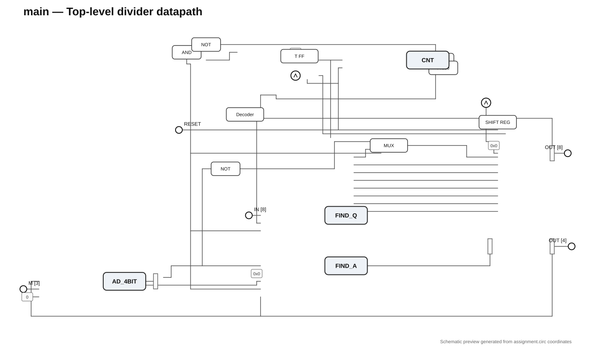
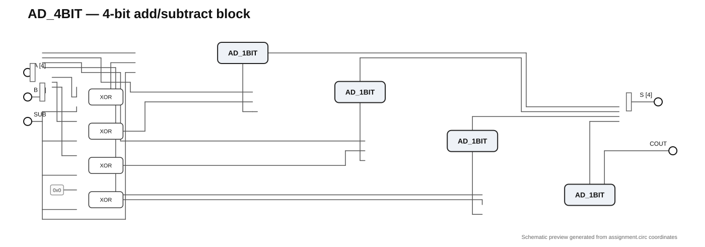
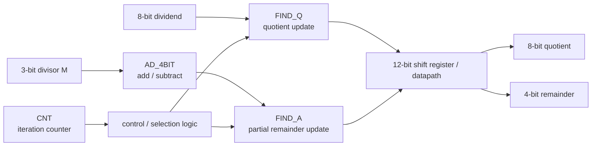

# 8-bit / 3-bit Sequential Divider — Logisim Evolution

A sequential binary divider designed and simulated in **Logisim Evolution** for **Digital Logic Design** at the **National Technical University of Athens (NTUA)**.

The project divides an **8-bit unsigned dividend** by a **3-bit unsigned divisor** using an iterative restoring-division-style datapath. The top-level circuit produces an **8-bit quotient** and a **4-bit remainder**.

> **Project source:** [`assignment.circ`](./assignment.circ)  
> **Logisim Evolution:** 4.0.0  
> **Entry circuit:** `main`

## Highlights

- Hierarchical circuit design built from reusable arithmetic, storage and control blocks
- 4-bit add/subtract unit constructed from 1-bit full adders
- Sequential quotient and partial-remainder updates
- Counter-driven iteration/control logic
- 12-bit shift-register datapath at the top level
- Complete implementation preserved in a single Logisim Evolution project file

## Circuit previews

The previews below were generated directly from the component coordinates and wiring stored in `assignment.circ`. They are faithful schematic extracts of the project structure, but are **not native Logisim GUI screenshots**.

### Top-level divider



### 4-bit add/subtract unit



## Architecture

The active `main` design combines the input operands, arithmetic unit, quotient/remainder update logic, iteration counter and shift-register datapath.



This diagram is intentionally simplified; the Logisim file is the source of truth for the full wiring and control path.

## Top-level interface

| Signal | Width | Direction | Purpose |
| --- | ---: | --- | --- |
| Dividend | 8 bits | Input | Unsigned value to divide |
| `M` | 3 bits | Input | Unsigned divisor |
| `RESET` | 1 bit | Input | Resets the sequential state |
| Clock | 1 bit | Input | Advances the iterative divider |
| Quotient | 8 bits | Output | Division quotient |
| Remainder | 4 bits | Output | Final remainder / partial-remainder register output |

## Active building blocks

The top-level `main` circuit directly instantiates:

- **`AD_4BIT`** — 4-bit add/subtract unit, built from four `AD_1BIT` full adders
- **`CNT`** — iteration counter and `LAST` detection logic
- **`FIND_Q`** — quotient-selection/update logic
- **`FIND_A`** — partial-remainder selection/update logic

It also uses Logisim shift registers, multiplexers, a decoder, flip-flops, splitters and gate-level control logic.

The project retains several intermediate/development circuits from the design process. See [`CIRCUITS.md`](./CIRCUITS.md) for the full inventory.

## Running the project

1. Install **Logisim Evolution 4.0.0** or a compatible newer version
2. Clone or download this repository
3. Open [`assignment.circ`](./assignment.circ)
4. Select the **`main`** circuit
5. Set the 8-bit dividend and 3-bit divisor `M`
6. Use `RESET` to initialise the sequential state
7. Step or run the clock to execute the division

## What I learned

This project gave me hands-on experience with:

- Hierarchical digital-circuit design
- Ripple-carry addition
- Two's-complement subtraction
- Sequential datapaths and control
- Flip-flop based storage
- Shift-register arithmetic
- Counters and cycle-based control
- Implementing an iterative binary division algorithm in hardware

## Repository structure

```text
logisim-8bit-divider/
├── assignment.circ          # Complete Logisim Evolution project
├── CIRCUITS.md              # Circuit inventory and structure notes
├── README.md                # Project documentation
├── .gitattributes           # GitHub syntax highlighting for .circ files
└── images/
    ├── main-schematic.svg   # Generated top-level schematic preview
    └── ad_4bit-schematic.svg
```

## Course

**National Technical University of Athens (NTUA)**  
Electrical & Computer Engineering  
Digital Logic Design — 2026

## Author

**Antonis Kotopoulis**

- [GitHub profile](https://github.com/antoniskotopoulis08-jpg)
- [LinkedIn](https://www.linkedin.com/in/antonis-kotopoulis-6b5739411/)

## Academic integrity

This repository is published as a personal portfolio and educational reference. If you are taking a similar course, do not submit this project or parts of it as your own coursework.
